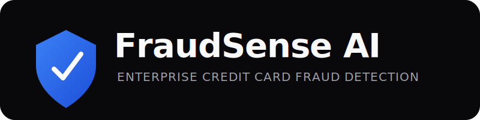

<div align="center">
  

  <br />
  
  
  
  
  
  
  
  
</div>

<br />

## Overview

**FraudSense AI** is an enterprise-grade Credit Card Fraud Detection System. It leverages robust dual-model machine learning architecture (Random Forest + XGBoost) and a rule-based Explainable AI engine to process financial transactions in real time. Wrapped in a premium, responsive, and minimalist SaaS interface, FraudSense AI is designed for professional deployment, technical demonstration, and portfolio presentation.

---

## What Makes FraudSense AI Different?

**Most student ML projects:**
- ❌ Only one ML model.
- ❌ Basic HTML/CSS styling.
- ❌ Simple binary output (Fraud/Not Fraud).
- ❌ Poor or missing documentation.
- ❌ No explainability.

**FraudSense AI:**
- ✓ **Dual ML Models**: Concurrent inference using Random Forest and XGBoost.
- ✓ **Explainable AI**: Rule-based transaction summaries explaining *why* a classification was made.
- ✓ **Risk Level Classification**: Graduated risk scoring (Low, Medium, High, Critical).
- ✓ **Confidence Score**: Percentage-based anomaly confidence tracking.
- ✓ **Professional UI**: A production-ready, dark-mode SaaS dashboard inspired by modern products (Vercel, Stripe).
- ✓ **Responsive Design**: Flawless scaling from mobile to 4K desktop screens.
- ✓ **Modular Architecture**: Clean separation between Flask API endpoints, ML models, and Vanilla JS frontend.
- ✓ **Production-ready Documentation**: Comprehensive open-source standards.
- ✓ **AICTE Internship Project**: Developed and polished as part of a structured ML program.

---

## Features

- **Real-Time Scoring**: Sub-second prediction API.
- **Contextual Banking Interface**: Simulates real-world transaction data (Merchant, Device, Geolocation, VPN, OTP).
- **Interactive Presets**: Instantly load realistic transaction scenarios (e.g., International Purchase, ATM Withdrawal) to evaluate model behavior.
- **Advanced Model Configuration**: Technical users can expose and manipulate raw PCA vectors (V1-V28) to observe direct model drift.

---

## Demo & Screenshots

> *Replace the placeholders below with actual screenshots of the running application.*

### Hero Screen


### Transaction Analysis & Contextual Inputs


### Prediction Result (Legitimate Example)


### Fraud Detection Explanation


### Responsive Mobile View


---

## Machine Learning Pipeline & Architecture

FraudSense AI is built around the famous Kaggle Credit Card Fraud dataset, which relies on PCA-transformed features to ensure data privacy.

1. **Input Simulation**: The frontend collects human-readable banking data (Merchant, VPN, OTP) alongside numerical parameters (Amount, Time, Duration).
2. **Feature Mapping**: The UI translates preset banking behaviors into appropriate PCA vector adjustments to simulate real-world behavior accurately against the trained model.
3. **Dual-Inference API**: The Flask backend routes the PCA vectors, scaled `Amount`, and `Time` parameters to pre-trained `scikit-learn` and `XGBoost` models.
4. **Consensus & Explainability**: The system evaluates both model outputs. If they disagree, a warning is raised. The risk level is calculated, and the context variables are used to generate a human-readable Explainable AI summary.

### Technology Stack
- **Backend**: Python 3.x, Flask, Joblib
- **Machine Learning**: Scikit-Learn (Random Forest), XGBoost, Numpy, Pandas
- **Frontend**: Vanilla JavaScript (ES6), HTML5, Custom CSS3 (Dark Theme)

---

## Installation & Usage

1. **Clone the repository:**
   ```bash
   git clone https://github.com/R0HIT-45/Credit_Card_Fraud_Detection_System.git
   cd Credit_Card_Fraud_Detection_System
   ```

2. **Create and activate a virtual environment:**
   ```bash
   python -m venv .venv
   # Windows
   .venv\Scripts\activate
   # macOS/Linux
   source .venv/bin/activate
   ```

3. **Install dependencies:**
   ```bash
   pip install -r requirements.txt
   ```

4. **Run the application:**
   ```bash
   python app.py
   ```

5. **Access the dashboard:**
   Open `http://127.0.0.1:5000` in your browser.

---

## Folder Structure

Please refer to [PROJECT_STRUCTURE.md](./PROJECT_STRUCTURE.md) for a detailed breakdown of the codebase architecture.

---

## Future Improvements

- **Database Integration**: Connect PostgreSQL to store a historical log of scored transactions.
- **Model Retraining**: Expand the core dataset to train directly on the categorical banking fields (Device, Location, Merchant) instead of relying strictly on PCA.
- **Authentication**: Add JWT-based login for bank administrators to secure the dashboard.

---

## AICTE Internship

This project was developed as part of a two-month AICTE Artificial Intelligence & Machine Learning Virtual Internship, with additional enhancements and production-quality UI/UX improvements completed independently.

FraudSense AI is a production-quality enhancement of a credit card fraud detection system developed during the internship. The original machine learning pipeline was extended with a redesigned enterprise interface, modular architecture, explainable predictions, responsive user experience, and comprehensive open-source documentation.

---

## License

This project is licensed under the [MIT License](./LICENSE).